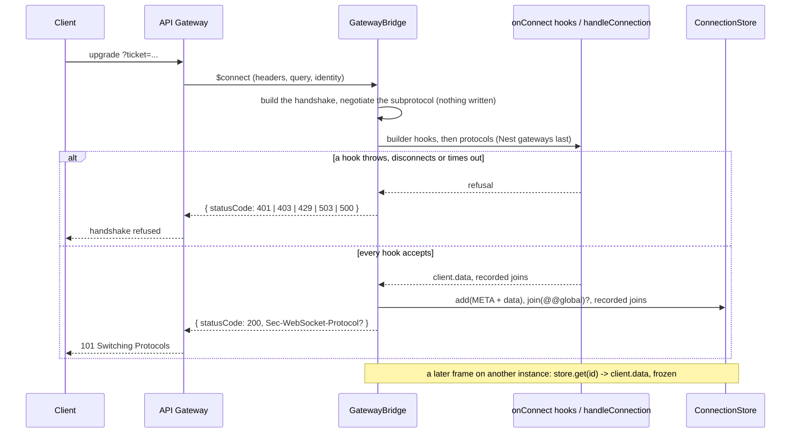
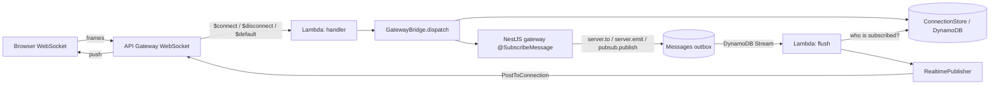
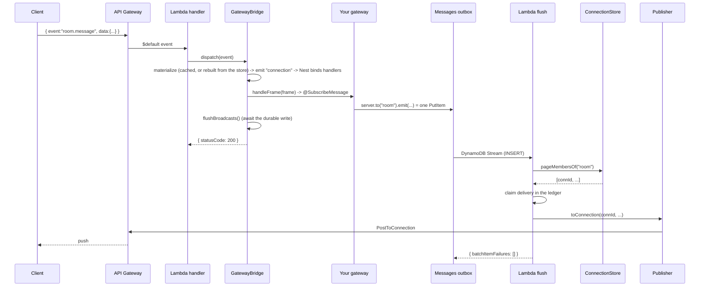

# apigw-ws-nest

> Run a standard **NestJS WebSocket gateway** over **AWS API Gateway WebSocket** — unchanged.

A custom NestJS `WebSocketAdapter` that lets you write `@WebSocketGateway` classes against the
ordinary Socket.IO‑shaped API (`@WebSocketServer() server.to(room).emit(...)`,
`@ConnectedSocket() client.join(room)`, `@SubscribeMessage`, `@Ack`) and run them **statelessly**
on Lambda behind API Gateway — with connections and rooms persisted in DynamoDB and delivery via
the `@connections` Management API.

The same gateway code also runs on a long‑lived HTTP server (ECS/Fargate) and on a zero‑AWS local
emulator, so you can develop and test the whole flow on your machine.

---

## Table of contents

- [Why](#why)
- [Install](#install)
- [Quick start](#quick-start)
- [Channels: global vs. scoped (rooms)](#channels-global-vs-scoped-rooms)
- [Durable fan-out (outbox + DynamoDB Streams)](#durable-fan-out-outbox--dynamodb-streams)
- [Protocols](#protocols)
- [GraphQL subscriptions](#graphql-subscriptions)
- [Gateway API](#gateway-api)
- [Authentication at `$connect`](#authentication-at-connect)
- [Architecture](#architecture)
- [The cross-instance rule (read this)](#the-cross-instance-rule-read-this)
- [Runtime modes](#runtime-modes)
- [Local development](#local-development)
- [Deploying to AWS with SST](#deploying-to-aws-with-sst)
- [DynamoDB data model](#dynamodb-data-model)
- [Configuration (environment)](#configuration-environment)
- [Public API reference](#public-api-reference)
- [Example app](#example-app)
- [Testing](#testing)
- [Build & publish](#build--publish)
- [Production notes & caveats](#production-notes--caveats)
- [Upgrading from 2.x](#upgrading-from-2x)
- [License](#license)

---

## Why

API Gateway WebSocket is **stateless and per‑message**: every frame is a separate Lambda
invocation, the connection lives in API Gateway (not your process), and you push to a client by
calling the `@connections` API with its `connectionId`. That's the opposite of a normal
long‑running Socket.IO server where one process holds every socket in memory.

This library bridges the two. It supplies synthetic `server` / `client` objects that implement the
familiar Socket.IO surface but back it with:

- a **ConnectionStore** (DynamoDB) for the connection registry and room membership, and
- a **RealtimePublisher** (the API Gateway `@connections` API) for delivery.

Your gateway never imports any of that. Swap the adapter and the same gateway runs on plain
Socket.IO/ws.

**Features**

- Standard NestJS gateways — `@SubscribeMessage`, `@MessageBody`, `@ConnectedSocket`, `@Ack`, plain
  returns, and `Observable` streams.
- **Rooms** (`client.join` / `server.to(room).emit`) — scoped, durable, cross‑instance.
- **Global channel** (`server.emit`) — every connection, auto‑subscribed on `$connect`.
- **[GraphQL subscriptions](#graphql-subscriptions)** — stock `@Subscription` resolvers over
  `graphql-transport-ws`, durable across instances. One `bridge.use()`, no module.
- **[Durable fan-out](#durable-fan-out-outbox--dynamodb-streams)** — a broadcast is recorded, then
  delivered by a DynamoDB Stream consumer: retried until it lands, ordered per topic, deduplicated.
- **[Authentication at `$connect`](#authentication-at-connect)** — `handleConnection` runs at
  `$connect`, awaited, with the handshake; throwing refuses the socket. Identity lives in
  `client.data`, persisted with the connection and rehydrated on any instance, so a plain Nest guard
  works everywhere.
- **Multiple gateways** on one connection (routes are merged, not overwritten).
- Three runtimes: **Lambda**, **HTTP (ECS/Fargate)**, **local emulator** — one codebase.
- Four pluggable ports — `ConnectionStore`, `RealtimePublisher`, `MessageBus`, `DeliveryLedger` —
  chosen a set at a time with `.provider()` or one at a time on the builder. No global state.
- Ships **ESM + CJS + types**.

---

## Install

```bash
npm install apigw-ws-nest
# or: pnpm add apigw-ws-nest
```

> **Coming from 2.x?** 3.0 changes what `handleConnection` means and turns the HTTP dispatch route
> off by default — read [Upgrading from 2.x](#upgrading-from-2x).

NestJS is a **peer dependency** — the library runs on the copy your app already has, **Nest 11 or
12** — so install the WebSocket stack next to it:

```bash
npm install @nestjs/common @nestjs/core @nestjs/websockets rxjs reflect-metadata
npm install @nestjs/platform-express   # or @nestjs/platform-fastify — see createNestApp's httpAdapter
```

`@nestjs/platform-express` is an *optional* peer: `createNestApp` falls back to Nest's default
(Express) only when you don't pass an `httpAdapter`, so a Fastify app never needs it. For **AWS
mode** the AWS SDK v3 packages are `optionalDependencies` (loaded lazily, so local mode never needs
them):

```bash
npm install @aws-sdk/client-dynamodb @aws-sdk/lib-dynamodb @aws-sdk/client-apigatewaymanagementapi
```

> Requires Node ≥ 20 and `reflect-metadata` imported once at your app's entry (this package imports
> it for you when you import from it). Nest 12 is ESM-only: an app that loads this package's
> **CommonJS** build alongside it relies on `require(esm)`, so use Node ≥ 20.19 (or ≥ 22.12).

---

## Quick start

### 1. Write a gateway (standard NestJS)

```ts
import {
  WebSocketGateway, WebSocketServer, SubscribeMessage,
  MessageBody, ConnectedSocket, Ack, WsResponse,
} from '@nestjs/websockets';
import { GatewayClient, GatewayServer } from 'apigw-ws-nest';

@WebSocketGateway()
export class ChatGateway {
  @WebSocketServer() server: GatewayServer;

  // Join a room (scoped topic). @Ack sends an immediate reply to THIS client.
  @SubscribeMessage('room.join')
  join(
    @ConnectedSocket() client: GatewayClient,
    @MessageBody() data: { room: string },
    @Ack() ack: (r: WsResponse) => void,
  ) {
    client.join(data.room);
    ack({ event: 'room.joined', data: { room: data.room } });
  }

  // Broadcast to a room — only members receive it.
  @SubscribeMessage('room.message')
  async message(@MessageBody() data: { room: string; text: string }) {
    await this.server.to(data.room).emit('room.message', data);
    return { event: 'room.message.ack', data: { ok: true } }; // plain return = reply to caller
  }

  // Broadcast to EVERYONE (global channel; no join needed).
  @SubscribeMessage('announce')
  async announce(@MessageBody() data: { text: string }) {
    await this.server.emit('announcement', data);
  }
}
```

### 2. Module

```ts
import { Module } from '@nestjs/common';

@Module({ providers: [ChatGateway] })
export class AppModule {}
```

### 3. Lambda handler — one export, every trigger

An ordinary NestJS bootstrap — `NestFactory.create` plus `useWebSocketAdapter`, the same shape as
swapping in Socket.IO's `IoAdapter`. The bridge is built **once per warm container** (outside the
handler), the app is initialized once, and **`bridge.serve()` routes by event shape**: an API Gateway
event goes to `dispatch`, a DynamoDB Stream event goes to `flush`.

```ts
import { NestFactory } from '@nestjs/core';
import { ApiGatewayWsAdapter, GatewayBridge } from 'apigw-ws-nest';
import { AppModule } from './app.module';

// .provider('aws') picks a matched set of backends: DynamoDB store, @connections
// publisher, outbox bus, Dynamo delivery ledger.
const bridge = GatewayBridge.builder().provider('aws').build();

async function bootstrap() {
  const app = await NestFactory.create(AppModule);
  // BEFORE init(): registers the { event, data } protocol on the bridge and
  // binds the @SubscribeMessage handlers to it.
  app.useWebSocketAdapter(new ApiGatewayWsAdapter(app, bridge));
  await app.init();
  return app;
}

let ready: Promise<unknown> | undefined;

export const handler = async (event: any, context?: any) => {
  await (ready ??= bootstrap());   // dedupes concurrent cold starts
  return bridge.serve(event, context);
};
```

Those two middle lines are all `createNestApp` does, if you'd rather have the shorthand:

```ts
const app = await createNestApp(AppModule, bridge);
await app.init();
```

The adapter's defaults are the Lambda ones: a gateway's `handleConnection` runs at `$connect`,
awaited, and can refuse the socket ([Authentication at `$connect`](#authentication-at-connect)), and
no HTTP route is registered — `bridge.serve()` is the only entry point.

Point `$connect`, `$disconnect`, `$default` **and the outbox table's stream** at this one function
(see [Deploying](#deploying-to-aws-with-sst)). That's it.

### Why one function and not four

SST will happily create a Function per WebSocket route plus one for the stream. Don't: they all need
the **same booted Nest app** — fan-out re-executes a subscription per subscriber, so it needs the
schema and the DI container — and four functions means four mostly-cold pools, each paying the
~0.5 s Nest boot on its own.

It hurts the stream consumer most. Stream traffic is bursty, so a dedicated flush function goes cold
between bursts and pays the boot *moments after another container finished the very mutation that
produced the record*. Measured on this repo's demo:

| | invocations | cold starts |
|---|---|---|
| dedicated flush Function | 74 | **10 (13.5%)** |
| shared with the WS routes | 70 | **4 (5.7%)** |
| ...one e2e run in steady state | 38 | **0** |

One pool, kept warm by the WebSocket traffic the stream records are a consequence of. The trade is a
shared concurrency pool — a fan-out storm competes with `$connect` — and reserved concurrency is the
lever if that ever bites.

`dispatch()` and `flush()` remain public if you'd rather route them yourself.

### The builder

`provider()` is a shorthand for four backends at once. Any of them can be replaced individually, and
the individual setters win regardless of call order:

```ts
const bridge = GatewayBridge.builder()
  .provider('aws')                    // store + publisher + bus + ledger
  .store(new MyConnectionStore())     // ...but use mine for this one
  .publisher((store) => new MyPublisher(store))
  .concurrency(50)                    // sends in flight per fan-out page
  .use(someProtocol)                  // a wire protocol (see below)
  .onConnect(authenticate)            // refuse or identify at $connect (see Authentication)
  .build();                           // or .build(MyBridge) for a subclass
```

The result owns everything it needs — `bridge.store`, `bridge.publisher`, `bridge.bus`,
`bridge.flusher` — so two bridges in one process share nothing, and "which store is this?" is
answerable at the call site. There are no module-level singletons anywhere in the library.

### Wire protocol

Clients send and receive newline‑free JSON frames:

```jsonc
// client -> server  (delivered to @SubscribeMessage('room.join'))
{ "event": "room.join", "data": { "room": "general" } }

// server -> client  (an @Ack, a plain return, or a broadcast)
{ "event": "room.joined", "data": { "room": "general" } }
```

API Gateway must have a **`$default`** route so non‑reserved frames reach the handler.

---

## Channels: global vs. scoped (rooms)

There are two durable, cross‑instance ways to fan out — both backed by the `ConnectionStore`, never
by in‑process state.

| | Subscribe | Broadcast | Reaches |
|---|---|---|---|
| **Global** | automatic on `$connect` | `server.emit(event, data)` | every connection |
| **Scoped (room)** | `client.join(room)` | `server.to(room).emit(event, data)` | room members only |

```ts
// GLOBAL — like Socket.IO's io.emit(...). Every connection is auto-joined to the
// global room on $connect, so this reaches all of them, across instances.
await this.server.emit('announcement', { text: 'Maintenance at 5pm' });

// SCOPED — only connections that called client.join('orders:42').
await this.server.to('orders:42').emit('order.updated', order);
```

"Global without a room" is simply **one room everyone is in** — the membership still lives in the
store so it survives redeploys and spans instances.

> Connections that negotiated a **subprotocol** (i.e. GraphQL clients) are deliberately left out of
> the global room, so a `server.emit` can't push a `{ event, data }` frame into a socket that
> speaks something else. See [the two protocols must not cross](#the-two-protocols-must-not-cross).

What you `await` on either of those calls is the **durable record of the broadcast**, not the
fan-out — see below.

---

## Durable fan-out (outbox + DynamoDB Streams)

`server.to(room).emit(...)` and `pubsub.publish(topic, ...)` do **not** deliver anything themselves.
They write one row to the `Messages` table and return. That row's `INSERT` is what triggers delivery:

```
publish()  ->  PutItem (Messages)  ->  DynamoDB Stream  ->  flush Lambda
                                                               |
                                          page subscribers  <--+
                                          claim + deliver each
```

### Why

The obvious implementation — look the subscribers up and post to each one, right there in the
invocation that published — has three problems that only show up in production:

1. **A failed delivery was gone.** Nothing had recorded that it was owed, so nothing retried it. A
   Lambda timeout partway through a fan-out silently dropped every remaining subscriber.
2. **The publisher paid for every subscriber.** One mutation with 500 subscribers meant 500
   `@connections` calls before the mutation could return.
3. **No ordering.** Two concurrent publishes to one topic raced.

A stream record is redelivered until the consumer reports success (up to 24h, then a DLQ), the
publishing invocation now does one `PutItem` regardless of subscriber count, and because the
partition key *is* the topic, the stream preserves order within it.

### What Streams don't give you

Stream delivery is **at-least-once**. A batch that fails partway is redelivered whole, so a naive
consumer re-sends to subscribers it already served. Streams create the need for idempotency rather
than supplying it.

So the flusher keeps a **delivery ledger**: before sending to a subscriber it writes a
`DLV#<messageId>#<key>` row with `attribute_not_exists`, and releases it if the send fails. A retry
therefore skips whoever already received the message and re-sends only to whoever didn't. The cost
is one conditional write per delivery.

### Batching and continuation

One outbox row is one topic, so **one flush invocation serves that topic's whole subscriber list**,
in bounded-concurrency batches. If a topic is too large to finish in the time left, the flusher
requeues the remainder under the **same `messageId`** with a cursor — so it resumes rather than
restarts, and the ledger still suppresses the part already delivered.

### The trade

| | inline (before) | outbox + stream |
|---|---|---|
| publisher cost | O(subscribers) | O(1) — one `PutItem` |
| delivery latency | ~10–50 ms | ~100–500 ms (measured on the demo) |
| failed delivery | lost, silently | retried, then DLQ |
| ordering per topic | none | FIFO |
| duplicates | none | suppressed by the ledger |

You are buying delivery certainty with latency. If that trade is wrong for a given workload, the
publisher's `toRoom()` is still an immediate, best-effort fan-out.

### Adding your own kind

The outbox is agnostic — `kind` is the discriminator, and a kind is contributed by a
[protocol](#protocols). Doing so inherits retry, ordering, batching and idempotency:

```ts
bridge.use({
  name: 'presence',
  handleFrame: async () => false,          // this one only fans out
  fanout: {
    presence: async (record, cursor) => ({
      targets: (await whoCares(record)).map((id) => ({
        connectionId: id,
        key: `CONN#${id}`,                 // identity within this message, for the ledger
        send: () => bridge.publisher.toConnection(id, 'presence', record.payload),
      })),
      cursor: undefined,                   // return one to be paged
    }),
  },
});

await bridge.publish({ kind: 'presence', payload: { userId, status: 'online' } });
```

`room` is built into the bridge (`server.to()` must work with no protocol registered); `topic` comes
from the GraphQL protocol.

---

## Protocols

A wire protocol is one object. The `{ event, data }` NestJS protocol and graphql-transport-ws are the
same kind of thing — parse a frame, route it, fan out — so they register identically, and
`dispatch()` has no special case for either:

```ts
export interface ProtocolHandler {
  readonly name?: string;
  readonly subprotocol?: string;                     // negotiated at $connect
  readonly fallback?: boolean;                       // consulted last
  readonly fanout?: Record<string, FanoutResolver>;  // outbox kinds it delivers
  attach?(bridge: GatewayBridge): void;
  handleFrame(frame, client, event): Promise<boolean>;   // true = it was mine
  onConnect?(client: GatewayClient, event): Promise<void>;   // $connect: throw to refuse
  onDisconnect?(connectionId: string, client?: GatewayClient, reason?: string): Promise<void>;
}

bridge.use(handler);   // frames, connect + disconnect hooks, fan-out kinds, subprotocol
```

Two consequences worth knowing:

- **Subprotocols are derived, not configured.** `graphql-transport-ws` is offered at `$connect`
  exactly when a handler declaring it is registered. Add `.subprotocols('x')` on the builder only for
  ones no handler owns.
- **`fallback: true` means "no frame signature".** The NestJS protocol can't recognise its own frames
  (any JSON object with an `event` could be one), so it must only see what nobody else claimed.
  `ApiGatewayWsAdapter` registers it for you.
- **`onConnect` is a connect hook** — it can refuse the socket and write `client.data`; see
  [Authentication at `$connect`](#authentication-at-connect). `onDisconnect` runs before the
  connection's rows are dropped, and receives the client (with its `data`) when there is one, plus
  why: the `$disconnect` reason, `'gone'` after a `410`, or `'server disconnect'`.

---

## GraphQL subscriptions

The same socket also speaks **`graphql-transport-ws`**, so a browser's
[`graphql-ws`](https://github.com/enisdenjo/graphql-ws) client talks to ordinary NestJS
`@Resolver` / `@Subscription` code through API Gateway.

There is **no module, no provider and no adapter to swap**. It is a
[protocol](#protocols) like any other, and the shape is
[graphql-sse](https://github.com/enisdenjo/graphql-sse)'s: hand it the schema, register it.

```ts
import { GraphQLSchemaHost } from '@nestjs/graphql';
import { createGraphQLWsHandler } from 'apigw-ws-nest/graphql';

const { schema } = app.get(GraphQLSchemaHost);
bridge.use(createGraphQLWsHandler({ schema }));
```

`enableGraphQLSubscriptions` is those three lines, for the common case:

```ts
import { NestFactory } from '@nestjs/core';
import { ApiGatewayWsAdapter, GatewayBridge } from 'apigw-ws-nest';
import { enableGraphQLSubscriptions } from 'apigw-ws-nest/graphql';

const bridge = GatewayBridge.builder().provider('aws').build();
const app = await NestFactory.create(AppModule);
app.useWebSocketAdapter(new ApiGatewayWsAdapter(app, bridge));
await app.init();
const pubsub = enableGraphQLSubscriptions(app, bridge);   // <- the whole wiring
```

It goes **after** `app.init()` on purpose: `GraphQLModule` builds the schema during its own init,
so by this point the schema exists and there is no lifecycle-ordering guesswork. A misordered call
throws at boot rather than on the first client frame.

...and keep `GraphQLModule.forRoot` exactly as you'd write it anywhere else — with **no
`subscriptions:` key**, because the built-in graphql-ws server needs a long-lived `http.Server`,
which is the one thing a Lambda doesn't have:

```ts
GraphQLModule.forRoot<ApolloDriverConfig>({
  driver: ApolloDriver,
  autoSchemaFile: true,                // in memory — Lambda's fs is read-only outside /tmp
  context: apiGwPubSubContext(pubsub), // optional; only for the HTTP endpoint (see below)
})
```

> `forRoot` is evaluated when your `AppModule` is *defined*, before the bridge exists — so if you
> want the HTTP endpoint to publish through the same PubSub, create it yourself in a module both can
> import and pass it to both: `apiGwPubSubContext(pubsub)` here, and
> `enableGraphQLSubscriptions(app, bridge, { pubsub })` there. Two visible references to one object,
> instead of a singleton resolved behind your back.

The resolver is stock NestJS and **names no transport at all**. It reads the PubSub off the GraphQL
context and types it as `graphql-subscriptions`' own `PubSub` — `ApiGwPubSub` *extends* that class,
so the standard contract is the contract:

```ts
import { PubSub } from 'graphql-subscriptions';

@Resolver(() => PostModel)
export class PostResolver {
  constructor(@Inject(PostService) private readonly posts: PostService) {}

  @Mutation(() => PostModel)
  async createPost(
    @Context('pubsub') pubsub: PubSub,
    @Args('title', { type: () => String }) title: string,
  ) {
    const post = await this.posts.create({ title, body: '' });
    await pubsub.publish('POST_ADDED', { post });   // await it: the container freezes on return
    return post;
  }

  // GLOBAL topic — every subscriber.
  @Subscription(() => PostModel, { resolve: (p) => p.post })
  postAdded(@Context('pubsub') pubsub: PubSub) {
    return pubsub.asyncIterableIterator('POST_ADDED');
  }

  // DYNAMIC topic — only this feed's subscribers are even looked up.
  @Subscription(() => PostModel, { resolve: (p) => p.post })
  postAddedIn(@Context('pubsub') pubsub: PubSub, @Args('feed', { type: () => String }) feed: string) {
    return pubsub.asyncIterableIterator(`POST_ADDED#${feed}`);
  }

  // GLOBAL topic + a server-side filter, evaluated per subscriber at publish time.
  @Subscription(() => PostModel, {
    resolve: (p) => p.post,
    filter: (p, vars) => p.post.title.includes(vars.term),
  })
  postAddedMatching(@Context('pubsub') pubsub: PubSub, @Args('term', { type: () => String }) term: string) {
    return pubsub.asyncIterableIterator('POST_ADDED');
  }
}
```

There is no `apigw-ws-nest` import in that file. Point the context factory at an in-process `PubSub`
and it runs unchanged on a long-lived server.

Nothing in the feature module mentions subscriptions at all — `providers: [PostResolver]` and done.
A service that needs to publish outside a resolver takes the same `ApiGwPubSub` instance the
context hands resolvers — the one `enableGraphQLSubscriptions` returned.

### Why the wiring can't come from the context either

The natural wish is to let GraphQL hand us everything GraphQL needs — schema included — through the
context factory. It can't, for an ordering reason: the context is only built once we are **already
executing an operation**, and to know that an inbound API Gateway frame *is* an operation, something
must have inspected the frame first. That inspector is the `GatewayBridge` frame handler, strictly
upstream of the context:

```
frame handler registered → frame recognised as graphql-transport-ws → operation executed → context built
```

So the registration cannot be bootstrapped from the thing it produces. What it *can* be is explicit
and late — which is exactly what `enableGraphQLSubscriptions(app, bridge)` is.

### And Apollo can't execute subscriptions at all

Routing through Apollo instead isn't an option even if you wanted it. `ApolloServer#executeOperation`
does **not** run a subscription's `subscribe` — it executes the operation like a query, so `resolve`
receives `undefined`:

```
QUERY  -> {"data":{"ping":"pong"}}
SUBSCR -> {"errors":[{"message":"Cannot read properties of undefined (reading 'ticks')", ...
```

Apollo's own recommended subscription setup (`graphql-ws` + `useServer`) bypasses Apollo Server and
calls graphql-js directly with the schema. That is precisely what this transport does — the schema
comes from `GraphQLSchemaHost`, which is driver-agnostic, so Mercurius works the same way.

### Why the context, and where the portability actually stops

Reading the PubSub off the context is what keeps the resolver portable: the same file runs on a
long-lived server with `graphql-subscriptions`' in-process `PubSub` and on Lambda with this one.
Swapping providers is one edit to the context factory — no resolver, module or import changes.
That's this library's thesis (one codebase, three runtimes) applied to GraphQL.

One direction of that swap is a lie, and it's worth being blunt: going **to** an in-process PubSub
only works on a runtime that holds the socket. On Lambda its iterator dies with the invocation and
the subscription silently never fires. The code is portable; the runtime is the constraint.

**You usually don't need `apiGwPubSubContext()`.** Operations arriving over the API Gateway socket
get `pubsub` in their context automatically, because the transport builds that context itself. The
helper is for the *other* path — the HTTP GraphQL endpoint in ECS/HTTP mode, whose context comes
from Apollo's own factory, which the WebSocket path bypasses. Pass your own factory to merge it:
`apiGwPubSubContext(({ req }) => ({ user: req.user }))`.

**What `ApiGwPubSub` inherits and what it can't.** It extends `graphql-subscriptions`' `PubSub`, so
`publish`, `asyncIterableIterator` (v3) and `asyncIterator` (v2) all behave as documented. The one
member it cannot honour is `subscribe(trigger, onMessage)` — the callback form: that callback would
live and die inside a single Lambda invocation, so it throws with an explanation rather than
returning an id for a subscription that will never fire. (Called with a single argument it's the
graphql-yoga spelling of "give me the stream", and forwards to `asyncIterableIterator`.)

### Why the PubSub has to be swapped

`graphql-subscriptions`' PubSub hands the subscription field an `AsyncIterator` and **parks it in
memory** until a `publish()` pushes into it. On Lambda that iterator dies the moment the invocation
returns, and the next frame may land on a different container — the same
[cross-instance rule](#the-cross-instance-rule-read-this) that rules out an in-gateway `Subject`.
A subscription that works locally is silently dropped in production.

`ApiGwPubSub` never parks anything. It persists what's needed to **re-run** the subscription later:

| | |
|---|---|
| `subscribe` | run graphql's `createSourceEventStream` only to **learn the topics**, then store `{connectionId, subscriptionId, topics, query, variables, connectionData}` and throw the stream away |
| `publish` | read the rows for that topic and **replay** each one: re-run the source stage with a one-shot stream carrying the payload, then `execute()` with it as `rootValue` |
| `complete` / `$disconnect` / `410` | delete the rows |

Replaying through the real graphql machinery is what makes `@Subscription({ filter })` keep working:
Nest wraps the field's `subscribe` in `withFilter`, and on replay that wrapper pulls the payload and
applies the filter for real, with **that subscriber's own variables**. A rejected payload simply
reports `done` and no frame is sent.

**Prefer dynamic topics over filters.** A topic is one DynamoDB partition, so `postAddedIn(feed)`
only wakes that feed's subscribers, while a filtered global topic wakes everyone and discards most
of them.

### What runs over the socket

`connection_init`/`ack`, `ping`/`pong`, `subscribe`, `next`, `error`, `complete` — the protocol
constants and the validating parser come from the `graphql-ws` package itself, so anything accepted
is something its client would have produced. Queries and mutations are single-result operations that
graphql-ws also runs over the socket, which is how a client triggers a fan-out with **no HTTP
endpoint at all**.

Three things this library had to add to the core transport for it:

- **Subprotocol negotiation.** `graphql-ws` offers `Sec-WebSocket-Protocol: graphql-transport-ws`
  and a browser aborts the handshake unless the server echoes it. API Gateway takes that from the
  `$connect` integration response, so `GatewayBridge` returns it in `headers`. The bridge collects
  the subprotocols from its registered protocols, so this one is offered exactly when the GraphQL
  protocol is present.
- **Raw sends.** graphql-ws frames are `{ type, id, payload }` and must not be wrapped in this
  library's `{ event, data }` envelope, hence `RealtimePublisher.toConnectionRaw`.
- **Protocol isolation on the global channel** — see below.

### The two protocols must not cross

`server.emit(...)` fans out to `GLOBAL_ROOM`, which every connection auto‑joins on `$connect`. Left
alone, that means a `{ event, data }` broadcast from an ordinary `@WebSocketGateway` gets delivered
to your **GraphQL** sockets too — and `graphql-ws` treats any frame it can't parse as a fatal
protocol violation, so it closes the connection (`4400`) and every subscription on it dies. One
unrelated `server.emit` would silently disconnect every subscriber.

So a connection that **negotiated a subprotocol does not join the global room**. Its subprotocol is
recorded in `SessionMeta`, and its fan‑out is its GraphQL subscriptions — which is what it asked
for. Rooms are unaffected: a graphql-ws client never reaches `client.join`, since that only happens
inside a `@SubscribeMessage` handler.

Both protocols still share one API Gateway, one Lambda and one connection table — they just don't
deliver into each other's sockets.

`graphql-ws`'s *server* (`makeServer`) is deliberately **not** used: it keeps the connection context
and every subscription's iterator in memory for the socket's lifetime, so over API Gateway it would
ack the handshake and then lose every subscription when the invocation returned.

### Identity: `@Context('connection')`

Every operation over the socket gets the connection's identity in its context, as
`connection: { id, data }` — the `client.data` your `handleConnection` (or any connect hook) wrote at
`$connect`:

```ts
@Query(() => String, { nullable: true })
whoami(@Context('connection') connection?: { data: { user?: { name: string } } }) {
  return connection?.data.user?.name ?? null;
}
```

The `context` option's callback receives it too: `context: (connectionId, { data }) => ({ ... })`.

Replays are the subtle part. A publish re-executes every stored subscription from the flush path,
with no client and no frame, and reading the connection back there would cost a store read per
subscriber per publish. So `client.data` is **snapshotted into the subscription's registry row** at
subscribe time (`connectionData`). Since `data` can't change after `$connect`, the snapshot is exact
— and `maxConnectionData` keeps each row's share of it bounded.

**Authenticate GraphQL sockets at `$connect`, not at `connection_init`.** `connectionParams` arrive
only after API Gateway has accepted — and billed — the socket, and `connection_init` is acknowledged
unconditionally. Pass a short-lived ticket in the query string, or a `Sec-WebSocket-Protocol` entry
next to `graphql-transport-ws`: the same `handleConnection` then covers both protocols.

### Storage

Subscription rows share `CONNECTIONS_TABLE` with the connection registry — no extra table:

| `pk` | `sk` | meaning |
|---|---|---|
| `GQLTOPIC#<topic>` | `CONN#<conn>#SUB#<sub>` | forward — the fan-out lookup |
| `CONN#<conn>` | `GQLSUB#<sub>` | reverse — so `$disconnect` can find the forward rows |

### Extra dependencies

`graphql`, `graphql-ws`, `graphql-subscriptions` and `@nestjs/graphql` are **optional peer
dependencies**, and the GraphQL code lives behind its own entry point, so apps that don't use it
never load any of it:

```bash
npm install graphql graphql-ws graphql-subscriptions \
            @nestjs/graphql @nestjs/apollo @apollo/server @as-integrations/express5
```

### One build caveat, and it will bite you

**esbuild does not implement `emitDecoratorMetadata`** — it's a type-directed emit, and esbuild
doesn't type-check. Most of this repo copes by never relying on it (note the explicit
`@Inject(Token)` everywhere). `@nestjs/graphql` can't: `@Args()` unconditionally reads
`design:paramtypes[index]`, so with no metadata the schema build throws inside `app.init()` with

```
Cannot read properties of undefined (reading '0')
  at extractTypeIfArray (@nestjs/graphql/dist/utils/reflection.utilts.js)
```

which reaches the client as a bare **`502` on the WebSocket handshake** — no GraphQL error, nothing
on the wire to explain it.

So compile with **tsc** first and point the Lambda at the output (`tsconfig.lambda.json` +
`pnpm build:lambda`), and set `nodejs.format: 'cjs'` so the CommonJS entry keeps its named `handler`
export. Also give every `@Field`/`@Args` an explicit type (`@Field(() => String)`,
`@Args('id', { type: () => ID })`) — good practice regardless, and it removes one whole class of
cold-start surprise.

---

## Gateway API

Everything below is the standard NestJS WebSocket surface; this library just implements it.

### `@WebSocketServer() server: GatewayServer`

- `server.to(room).emit(event, data): Promise<void>` — broadcast to a room.
- `server.emit(event, data): Promise<void>` — **global** broadcast (the `io.emit` analog).
- (`server` is also the connection hub; internal EventEmitter events like `'connection'` are not
  broadcast.)

### `@ConnectedSocket() client: GatewayClient`

- `client.join(room): Promise<void>` / `client.leave(room): Promise<void>` — room membership
  (persisted in the store). During `$connect`, recorded and applied once the connection is accepted.
- `client.emit(event, data): Promise<void>` / `client.send(frame): Promise<void>` — send to **this**
  connection. Awaited by the dispatch even when you don't `await` it, so a Lambda can't freeze
  mid-send.
- `client.connectionId: string`.
- `client.handshake: Handshake` — Socket.IO's `socket.handshake`: `headers`, `query`,
  `subprotocols`, `subprotocol`, `sourceIp`, `userAgent`, `connectedAt`, `authorizer`. Complete only
  during `$connect` — see [what survives](#what-survives-connect-and-what-doesnt).
- `client.data: TData` — Socket.IO's `socket.data`, where identity lives; `GatewayClient<TData>`
  types it.
- `client.rehydrated: boolean` — rebuilt from the store rather than created by `$connect` here.
- `client.phase` — `'connecting'` | `'refused'` | `'open'`.
- `client.disconnect(): Promise<void>` — during `$connect`, refuse with `403`; afterwards, close the
  socket server-side.

### Handlers

- `@SubscribeMessage('event.name')` — routes a client frame's `event` to a method.
- `@MessageBody()` — the frame's `data`.
- `@Ack() ack: (r: WsResponse) => void` — send an **immediate acknowledgement** to the caller
  (separate from any broadcast).
- **Plain return** `WsResponse` — sent back to the caller (skipped if you used `@Ack`).
- **`Observable<WsResponse>` return** — a live per‑connection stream; each emission is delivered to
  the caller. (Useful for per‑connection server‑push; for fan‑out across clients use rooms/global.)

> `WsResponse` is `{ event: string; data: any }`.

### Connection lifecycle — handled for you

`bridge.dispatch` transparently handles `$connect` (registers the connection + auto‑joins the global
room), `$disconnect` (removes the connection from all rooms, tears down streams), and routes every
other frame to your handlers. Gateways never touch the store for lifecycle.

When `OnGatewayConnection` / `OnGatewayDisconnect` run depends on the adapter's `lifecycle`:

| | `'connect'` (the default) | `'legacy'` (the 2.x behaviour) |
|---|---|---|
| `handleConnection(client)` | **once, at `$connect`, awaited**, with the full `client.handshake`; throwing refuses the socket | lazily, on the first frame each instance sees for a connection; no handshake; fire-and-forget |
| `handleDisconnect(client, reason)` | on `$disconnect`, a `410 Gone` or `bridge.disconnect()`, with `client.data` still readable | never |

---

## Authentication at `$connect`

Identity is established **once**, when the socket opens, and read on every later frame — on any
instance. A connection that fails is refused at the handshake with a status of your choosing, and
nothing about it is ever written.

### The Nest way: `handleConnection` + a guard

`OnGatewayConnection.handleConnection(client)` runs **at `$connect`, awaited**, with the handshake on
`client.handshake`; throwing refuses the socket. Whatever it writes to `client.data` (Socket.IO's convention) is persisted with the
connection, and a plain `CanActivate` guard reads it back on any instance:

```ts
import { CanActivate, ExecutionContext, Inject, Injectable, UnauthorizedException, UseGuards } from '@nestjs/common';
import { ConnectedSocket, OnGatewayConnection, OnGatewayDisconnect, SubscribeMessage, WebSocketGateway } from '@nestjs/websockets';
import { GatewayClient } from 'apigw-ws-nest';

type Identity = { user: { id: string; roles: string[] } };

@WebSocketGateway()
export class RealtimeGateway implements OnGatewayConnection, OnGatewayDisconnect {
  constructor(@Inject(AuthService) private readonly auth: AuthService) {}

  // Once per connection, at $connect, awaited. Throwing refuses the socket.
  async handleConnection(client: GatewayClient<Identity>) {
    const user = await this.auth.verify(client.handshake.query.ticket);
    if (!user) throw new UnauthorizedException();           // -> 401 at $connect
    client.data.user = { id: user.id, roles: user.roles };   // persisted with the connection
    await client.join(`user:${user.id}`);                    // applied once accepted
  }

  handleDisconnect(client: GatewayClient<Identity>, reason?: string) {
    // client.data is still readable here; the connection's row goes right after.
  }

  @UseGuards(WsUserGuard)
  @SubscribeMessage('whoami')
  whoami(@ConnectedSocket() client: GatewayClient<Identity>) {
    return { event: 'whoami', data: client.data.user };
  }
}

@Injectable()
export class WsUserGuard implements CanActivate {
  canActivate(context: ExecutionContext) {
    // On ANY instance: the bridge rehydrated client.data from the store before Nest saw the frame.
    return !!context.switchToWs().getClient<GatewayClient<Partial<Identity>>>().data.user;
  }
}

// bootstrap — nothing to configure: lifecycle 'connect' is the default
app.useWebSocketAdapter(new ApiGatewayWsAdapter(app, bridge));
```

A refusing guard is Nest's own: it throws `WsException('Forbidden resource')`, and the base filter
answers with an `exception` frame. Calling `client.disconnect()` inside `handleConnection` — the
Socket.IO idiom — refuses with `403`. With several gateways, each `handleConnection` runs in the order
Nest binds them, and the first refusal stops the rest. It runs for **every** connection, whatever
subprotocol it negotiated; a gateway that only cares about `{ event, data }` sockets checks
`client.handshake.subprotocol`.

**How Nest is persuaded.** Nest calls `handleConnection` fire-and-forget whenever the hub emits
`'connection'` and drops the promise — a throw there is an unhandled rejection, not a refusal. So
the adapter finds the gateways the way Nest's `SocketModule` does, keeps
each original `handleConnection` for its own awaited call at `$connect`, and makes Nest's later call a
no-op (calling the method yourself still runs it). `handleDisconnect` is called from the bridge's
cleanup. Guards, pipes and interceptors do **not** run around `handleConnection` — Nest doesn't run
them there either. A request-scoped gateway can't be reached this way, so one that implements either
hook fails `app.init()` with an error naming it.

`lifecycle: 'legacy'` restores the 2.x behaviour exactly — `handleConnection` runs lazily, on the
first frame each instance sees, with no handshake; `handleDisconnect` never runs; frames are served
without reading the store. It is there for [upgrading](#upgrading-from-2x) gateways that need time,
not as a mode to build on.

### Without Nest: `bridge.onConnect`

The same mechanism, framework-agnostic. Hooks run in registration order, before any protocol's:

```ts
import { ConnectionRejectedError, GatewayBridge } from 'apigw-ws-nest';

const bridge = GatewayBridge.builder()
  .provider('aws')
  .onConnect(async (client, event) => {          // repeatable
    if (await rateLimited(client.handshake.sourceIp)) throw new ConnectionRejectedError(429);
    client.data.tenant = await tenantOf(client.handshake.headers.host);
  })
  .connectTimeout(10_000)                        // the whole hook chain; on expiry -> 503 (default 10s)
  .maxConnectionData(16 * 1024)                  // ceiling on client.data's JSON (default 16 KiB)
  .build();                                      // or .build(MyBridge) for a subclass

bridge.onConnect(hook);                          // the same, after build()
```

### In a protocol: `ProtocolHandler.onConnect`

Authentication that belongs to a wire protocol rather than to the app — a bearer offered as a
`Sec-WebSocket-Protocol` entry, a Phoenix `join_token` — goes in the protocol, next to its
`handleFrame`. Protocols' hooks run after the builder's, and the Nest gateways' last:

```ts
class PhoenixProtocol implements ProtocolHandler {
  readonly name = 'phoenix';
  async onConnect(client: GatewayClient) {
    const grant = await verify(client.handshake.query.join_token);
    if (!grant) throw new ConnectionRejectedError(401);
    client.data.grant = grant;               // claims, not the token
  }
  // handleFrame, onDisconnect, ...
}
```

Every connect hook needs `ConnectionStore.get()`, to rehydrate `client.data` elsewhere. Registering
one on a store without it throws at boot — better than a guard that passes on one container and
refuses on the next.

### How a refusal becomes a status

Resolved by the error's **shape**, never by `instanceof`, so the core needs no Nest import:

| The hook... | `$connect` answers |
|---|---|
| threw `ConnectionRejectedError(status)` | `status` |
| called `client.disconnect()` | `403` |
| threw a Nest `HttpException` — anything with `getStatus()` (`UnauthorizedException`, `ForbiddenException`, `new HttpException(msg, 429)`) | its status when 4xx, else `500` |
| threw `new WsException({ status: 403, message })` — `getError()` with a 4xx `status`/`statusCode` | that status |
| threw any other `WsException` | `401` |
| outlived `connectTimeout` | `503` |
| threw anything else (the database is down, a bug) | `500` — fail closed |

A 4xx answers with the exception's message (at most 200 characters) and is not logged: refusals are
expected traffic. A 5xx answers `connect failed` and is logged as `[connect: <hook or protocol>]`. A
refused connection writes nothing — no `META` row, no rooms (joins made by the hooks are discarded)
— and no `$disconnect` follows it.

### What survives `$connect`, and what doesn't

**One rule decides it: after `$connect`, a client looks the same on every instance** — the warm one
that ran the hooks, and a cold one that rebuilt it from the store.

| | during `$connect` | afterwards, on every instance |
|---|---|---|
| `client.handshake.headers` / `.query` / `.subprotocols` / `.userAgent` | the real ones | empty |
| `client.handshake.connectedAt` / `.subprotocol` / `.sourceIp` | ✓ | ✓ (persisted) |
| `client.handshake.authorizer` | ✓ | ✓ (API Gateway repeats it) |
| `client.data` | writable | as persisted: JSON-normalised, **deep-frozen** |
| `client.join()` / `client.leave()` | recorded, applied on accept | immediate |
| `client.emit()` / `.send()` / `.sendRaw()` | **throw** | immediate |

- **Headers are not persisted** — they are the bearer tokens. A guard reading
  `client.handshake.headers.authorization` therefore fails immediately in development, instead of
  passing on the warm instance and failing on scale-out.
- **`client.data` is normalised with a JSON round trip** on the connecting instance too (a `Date` is
  an ISO string everywhere), and capped by `maxConnectionData` — over the cap is a programming error
  and answers `500`.
- **Writing to `client.data` afterwards throws a `TypeError`.** A change made in a message handler
  would exist on one container only.
- **Don't put secrets in it.** It is stored in DynamoDB in clear: keep ids and claims, not tokens.
- **No sends during `$connect`.** API Gateway does not deliver to a connection whose `$connect` hasn't
  completed. `server.emit()` / `server.to(room).emit()` are fine — they are outbox writes, and the
  connecting socket is in no room yet.

Rehydration costs one strongly-consistent read per (instance, connection), not per frame: `data`
can't change after `$connect`, so the cached copy can't go stale. `client.rehydrated` says which one
you're holding.

### Getting a token to `$connect` from a browser

A browser can't set headers on a WebSocket. What works:

- **A short-lived, single-use ticket in the query string** — fetch it over authenticated HTTP, then
  `` new WebSocket(`${url}?ticket=${ticket}`) ``. Query strings reach API Gateway's access logs, hence
  short-lived and single-use.
- **An extra `Sec-WebSocket-Protocol` entry** — `new WebSocket(url, ['graphql-transport-ws',
  'bearer.<token>'])`. Every offered entry is in `client.handshake.subprotocols`, and only a
  registered protocol is ever echoed, so the token never comes back.
- **A cookie**, when the API sits on a custom domain that is same-site with your app.

### Identity lifetime, kicking, per-user rooms

- **Identity does not expire with the token.** API Gateway keeps a socket open up to two hours. Put an
  `expiresAt` in `client.data` and check it in your guard. `client.disconnect()` — or
  `bridge.disconnect(connectionId)` from anywhere — closes the socket server-side (`DeleteConnection`
  on AWS), after running the same cleanup as `$disconnect` with reason `'server disconnect'`.
- **Per-user rooms are the index.** `` client.join(`user:${id}`) `` in `handleConnection` makes
  `server.to('user:42').emit(...)` reach every socket of a user, and `store.membersOf('user:42')` list
  them.
- **Unknown connections are refused.** With a connect hook registered, a frame from a connection the
  store doesn't know (never accepted, or expired) reaches no protocol: it is answered `403`, logged,
  and the socket is closed. Connections opened before you turned the hooks on have no `data`, so your
  guards refuse them and the clients reconnect through the new `$connect` — fail-closed by
  construction.

### `$connect`, end to end



---


## Architecture



Note where the arrow to the publisher is: **not** in the invocation that handled the client frame.
Publishing records; the stream delivers. See
[durable fan-out](#durable-fan-out-outbox--dynamodb-streams).

**One frame, end to end:**



The handler returns at step 8, before anything has been delivered. If the flush fails at any point
after that, the stream redelivers the record and the ledger keeps whoever already received it from
receiving it twice.

**The pieces** (`src/`):

- `gateway-bridge.ts` — `GatewayBridge` (the entry point `dispatch`), plus the synthetic
  `GatewayServer` and `GatewayClient`. Defines `GLOBAL_ROOM` and auto‑join on connect, and the
  connect phase: hooks, accept, rehydration of `client.data`.
- `ws-adapter.ts` — `ApiGatewayWsAdapter`: the NestJS `WebSocketAdapter`. Binds `@SubscribeMessage`
  handlers (merging across multiple gateways), turns `@Ack`/returns/`Observable`s into outbound
  sends, takes `handleConnection`/`handleDisconnect` over (`lifecycle: 'connect'`), and registers
  the raw HTTP dispatch route for ECS mode.
- `ports.ts` — every swappable interface, in one place and importing nothing: `ConnectionStore`,
  `RealtimePublisher`, `MessageBus`, `DeliveryLedger`, the broadcast/fan-out vocabulary,
  `ConnectionGoneError` and `ConnectionRejectedError`.
- `outbox.ts` — the durable fan-out: buses (publish = one write), ledgers (idempotency) and
  `Flusher` (paging, batching, continuation, 410 reaping).
- `providers/aws.ts` — `DynamoConnectionStore` + `ApiGatewayPublisher`.
- `providers/local.ts` — `InMemoryConnectionStore` + `LocalPublisher` (+ `LocalSocketRegistry`).
- `providers/dynamo.ts` — lazy document client and `queryAll`/`queryPage`. A DynamoDB Query stops at
  1MB and returns a *prefix* with no error; these exist so that can't happen by omission.
- `app-factory.ts` — `createNestApp(rootModule, bridge)`.
- `dispatch-scope.ts` — makes fire‑and‑forget sends awaitable so the Lambda doesn't freeze
  mid‑flight. Scoped to one dispatch via `AsyncLocalStorage`: it used to be a module-level array,
  which is correct only while exactly one dispatch is in flight per process — true on Lambda, false
  in HTTP/ECS mode, where two concurrent requests shared (and reset) each other's queue.

---

## The cross-instance rule (read this)

Every Lambda invocation is a **separate, frozen process**, and the same connection may be served by
**different containers** over time. Therefore:

> **In‑process pub/sub cannot cross instances.** A Node `EventEmitter`, an RxJS `Subject`, or a
> `Map` of callbacks lives and dies with one container, so it only reaches listeners that happen to
> sit in that *same warm container*. The moment the subscriber's container is replaced (redeploy,
> scale‑out, plain concurrency), the message is silently lost.

The only state shared across instances is the **store** (DynamoDB) and the **`@connections` API**.
So any fan‑out that must reach a subscriber on another instance has to read membership from the
store and push by `connectionId`. That is exactly what **rooms** and the **global channel** do — and
why you should use them instead of an in‑gateway `Subject`/`fromEvent` for anything that must survive
a redeploy or span instances.

(Note: subscribing on the client with `socket.on(name)` is purely client‑side dispatch — it tells
the backend nothing. Scoping/authorization always lives server‑side, in rooms.)

---

## Runtime modes

One gateway codebase, three ways to run it:

| Mode | Entry | How frames arrive |
|---|---|---|
| **Lambda** (recommended) | `GatewayBridge.builder().provider('aws').build()` + `bridge.serve(event, ctx)` | one function, four triggers: the three WS routes and the outbox stream |
| **HTTP (ECS/Fargate)** | `createNestApp(...).listen(HTTP_PORT)` | API Gateway WebSocket→HTTP integration `POST`s events to the route `dispatchPath` registers (conventionally `DISPATCH_PATH`, `/@dispatch`), authenticated by `dispatchSecret` |
| **Local emulator** | `ts-node local-server.ts` | a real `ws` server emulates API Gateway and calls `dispatch` |

HTTP mode example:

```ts
import { createNestApp, DISPATCH_PATH, GatewayBridge, HTTP_PORT } from 'apigw-ws-nest';
import { AppModule } from './app.module';

const bridge = GatewayBridge.builder().provider('aws').build();
const app = await createNestApp(AppModule, bridge, {
  // The one runtime that needs the dispatch route — so it asks for it. The
  // secret defaults to APIGW_DISPATCH_SECRET.
  adapter: { dispatchPath: DISPATCH_PATH, dispatchSecret: process.env.APIGW_DISPATCH_SECRET },
  // httpAdapter: new FastifyAdapter(),   // optional; Express by default
});
await app.listen(HTTP_PORT); // the adapter registered POST /@dispatch
```

**The dispatch route is an entry point like any other.** It hands any JSON body to
`bridge.dispatch` as an API Gateway event — so once identity is keyed by `connectionId`, a forged
frame naming a live connection would be served *as* that connection. Hence:

- **No route unless `dispatchPath` asks for one.** Lambda never needs it, which matters most when the
  same app is also served over HTTP from Lambda (a function URL, Lambda Web Adapter): an unrequested
  route would be on the internet. `APIGW_DISPATCH_PATH` only changes the `DISPATCH_PATH` constant; it
  registers nothing by itself.
- **`dispatchSecret`** (default `APIGW_DISPATCH_SECRET`) makes the route require that value in
  `x-apigw-dispatch-secret` (or your `dispatchSecretHeader`), compared in constant time; anything else
  is answered `403` before the body is read. The API Gateway HTTP integration adds it with a request
  parameter mapping: `integration.request.header.x-apigw-dispatch-secret` = `'<secret>'`.

The adapter warns once at boot when the route is registered without a secret while connect hooks
are active. The route forwards the bridge's response headers through the HTTP adapter, so the
`$connect` `Sec-WebSocket-Protocol` echo leaves the process on Express and Fastify alike.

**Forward the handshake.** For connect hooks to see anything in HTTP mode, the integration's request
template must carry the headers and the query string. A starting point — not yet verified against a
deployed stage:

```vtl
{
  "requestContext": {
    "routeKey": "$context.routeKey", "eventType": "$context.eventType",
    "connectionId": "$context.connectionId", "domainName": "$context.domainName",
    "stage": "$context.stage", "requestId": "$context.requestId",
    "connectedAt": $context.connectedAt,
    "identity": { "sourceIp": "$context.identity.sourceIp" }
  },
  "headers": {#foreach($h in $input.params().header.keySet())"$h": "$util.escapeJavaScript($input.params().header.get($h))"#if($foreach.hasNext),#end#end},
  "queryStringParameters": {#foreach($q in $input.params().querystring.keySet())"$q": "$util.escapeJavaScript($input.params().querystring.get($q))"#if($foreach.hasNext),#end#end}
}
```

---

## Local development

The example ships a zero‑AWS emulator that plays the role of API Gateway: a `ws` server accepts
browser sockets, turns connect/message/disconnect into API Gateway‑shaped events, and routes pushes
back through an in‑memory registry.

```bash
pnpm dev            # ts-node src/example/src/local-server.ts  (RT_PROVIDER=local)
# test client : http://localhost:6005
# multi-chat  : http://localhost:6005/chat
# graphql     : http://localhost:6005/graphql
# websocket   : ws://localhost:6005
```

The emulator behaves like API Gateway at `$connect`: it dispatches the `CONNECT` event — with the
handshake headers, the query string and the client's address — **before** completing the upgrade,
so a refusing connect hook refuses the handshake itself (a `ws` client sees `unexpected-response`
with that status, a browser a failed handshake). It echoes whatever subprotocol the bridge
negotiated, so the browser's `graphql-ws` client completes its handshake locally too.

```bash
pnpm test:e2e       # real graphql-ws and ws clients against emulators the suites start themselves
curl http://localhost:6005/__connections/<id>   # dev-only: what the store holds for a connection
```

**Simulating a redeploy / new instance.** The emulator exposes a dev‑only endpoint that throws away
the in‑process Nest app + bridge and rebuilds them — **without** dropping the live sockets or the
durable store — so you can verify that subscriptions survive a "new Lambda instance":

```bash
curl -X POST http://localhost:6005/__reload   # = a fresh instance; rooms + connections persist
```

A typical test: open two browser tabs, join the same room in both, hit `/__reload`, then send a
message — it still arrives, because room membership lives in the store, not the (now‑rebuilt)
process. The e2e suite does exactly this for a GraphQL subscription — that single assertion is what
an in‑process PubSub cannot pass — and for identity: after `/__reload` the same socket is still the
same user, because `client.data` was rehydrated from the store.

---

## Deploying to AWS with SST

The repo includes an `sst.config.ts` that provisions everything. The shape:

```ts
// DynamoDB tables (single-table pk/sk for connections + chat; simple id for posts)
const connections = new sst.aws.Dynamo('Connections', {
  fields: { pk: 'string', sk: 'string' },
  primaryIndex: { hashKey: 'pk', rangeKey: 'sk' },
  ttl: 'ttl',              // $disconnect backstop + delivery-ledger expiry
});
// The outbox. Its stream IS the delivery trigger.
const messages = new sst.aws.Dynamo('Messages', {
  fields: { pk: 'string', sk: 'string' },
  primaryIndex: { hashKey: 'pk', rangeKey: 'sk' },
  stream: 'new-image',
  ttl: 'expiresAt',
});
const posts = new sst.aws.Dynamo('Posts', {
  fields: { id: 'string' }, primaryIndex: { hashKey: 'id' },
});
const chat = new sst.aws.Dynamo('Chat', {
  fields: { pk: 'string', sk: 'string' },
  primaryIndex: { hashKey: 'pk', rangeKey: 'sk' },
});

const api = new sst.aws.ApiGatewayWebSocket('Api');

// ONE function. Create it explicitly, then point every trigger at its ARN —
// passing FunctionArgs to each trigger would create a separate function per
// trigger, and four cold pools instead of one.
const gateway = new sst.aws.Function('Gateway', {
  handler: 'src/example/src/handler.handler',
  // link grants IAM: DynamoDB CRUD on the tables + execute-api:ManageConnections on the api.
  // EVERY table the handler touches must be here, or its calls throw AccessDenied.
  link: [connections, messages, posts, chat, api, dlq],
  environment: {
    RT_PROVIDER: 'aws',
    CONNECTIONS_TABLE: connections.name,
    MESSAGES_TABLE: messages.name,
    POSTS_TABLE: posts.name,
    CHAT_TABLE: chat.name,
    MANAGEMENT_ENDPOINT: api.managementEndpoint,
  },
  timeout: '60 seconds',
  // Referenced by ARN, SST cannot attach the subscriber's usual permissions — so
  // grant the stream reads here or the event source mapping fails at RUNTIME.
  permissions: [{
    actions: ['dynamodb:DescribeStream', 'dynamodb:GetRecords',
              'dynamodb:GetShardIterator', 'dynamodb:ListStreams'],
    resources: [messages.nodes.table.streamArn],
  }],
});

api.route('$connect', gateway.arn);
api.route('$disconnect', gateway.arn);
api.route('$default', gateway.arn);

messages.subscribe('Flush', gateway.arn, {
  filters: [{ eventName: ['INSERT'] }],
  transform: {
    eventSourceMapping: (args) => {
      args.functionResponseTypes = ['ReportBatchItemFailures'];  // honour our return value
      args.bisectBatchOnFunctionError = true;                    // isolate a poison record
      args.parallelizationFactor = 10;                           // order kept per partition key
      args.destinationConfig = { onFailure: { destinationArn: dlq.arn } };
    },
  },
});
```

Eight things that bite people:

1. **`link` is what grants IAM.** Setting only the `environment` table name gives you the name but
   no permissions → `AccessDeniedException` on the first DynamoDB call. Every table the handler uses
   must be in `link` (alongside the `api`, which grants `execute-api:ManageConnections`).
2. **DynamoDB key schema can't be altered in place.** This library's stores use composite **`pk` /
   `sk`** keys; changing a table's key schema later forces a *replace*.
3. **GraphQL needs a tsc pre-pass** (`handler: '.lambda/…'` + `nodejs.format: 'cjs'`) — see
   [the build caveat](#one-build-caveat-and-it-will-bite-you). `pnpm live` and `pnpm deploy` run it
   for you; use `pnpm watch:lambda` in a second terminal while iterating under `sst dev`.
4. **`@nestjs/graphql` probes for integrations you don't use** (fastify, federation, `ts-morph`).
   They're `require`d behind feature checks, so leaving them unresolved is fine — but esbuild fails
   the build unless they're listed in `esbuild.external`.
5. **`functionResponseTypes` is not optional.** The flush handler returns `{ batchItemFailures }`;
   without declaring it on the event source mapping that return value is **ignored** and any single
   failure re-runs the whole batch.
6. **`MANAGEMENT_ENDPOINT` must be in the environment.** A stream event carries no `requestContext`,
   so there is no `domainName` to derive the `@connections` endpoint from. Records carry it, and
   this is the fallback for any published outside a request.
7. **An ARN-referenced function gets no automatic permissions.** SST attaches the stream-read policy
   only when it *creates* the subscriber. Point a trigger at an existing ARN and you own that grant —
   and the omission fails at runtime on the event source mapping, not at deploy.
8. **Nest 12 is ESM-only, and the bundle is CommonJS.** esbuild leaves `import.meta` empty in a CJS
   bundle, and `@nestjs/graphql` calls `createRequire(import.meta.url)` while loading — the cold
   start dies with *"The argument 'filename' must be a file URL … Received undefined"*. The
   `sst.config.ts` here defines `import.meta.url` from `__filename` (an esbuild `define` plus a
   one-line `banner`) and uses the `nodejs22.x` runtime.

Deploy:

```bash
pnpm live           # build:lambda && sst dev --stage dev   (live Lambda)
pnpm deploy         # build:lambda && sst deploy --stage dev
pnpm remove         # sst remove --stage dev

# the end-to-end suites, against the deployed API instead of an emulator
# (steps that need the emulator's dev endpoints are skipped; E2E_LAG tunes the waits)
E2E_WS_URL='wss://<api-id>.execute-api.<region>.amazonaws.com/$default' pnpm test:e2e
```

The bridge sets the per‑request `@connections` management endpoint automatically from
`event.requestContext.domainName` / `stage`, so you don't configure `MANAGEMENT_ENDPOINT` yourself
for the WebSocket routes — only for the flush function, which has no request to read it from.

---

## DynamoDB data model

**Connections table** (`CONNECTIONS_TABLE`, composite `pk`/`sk`) — connection registry + room
interest map:

| `pk` | `sk` | meaning |
|---|---|---|
| `CONN#<id>` | `META` | `connectedAt`, `subprotocol?`, `sourceIp?`, `data?` (a map: `client.data`) (+ `ttl`, a safety net if `$disconnect` never fires) |
| `ROOM#<room>` | `CONN#<id>` | forward membership — `membersOf(room)` queries `pk = ROOM#<room>` |
| `CONN#<id>` | `ROOM#<room>` | reverse index — lets `remove(id)` clear *every* room on disconnect |
| `GQLTOPIC#<topic>` | `CONN#<id>#SUB#<sub>` | a GraphQL subscription — the fan‑out lookup, carrying its query + variables |
| `CONN#<id>` | `GQLSUB#<sub>` | reverse index for the above, so `$disconnect` can find the forward rows |
| `DLV#<messageId>#<key>` | `DLV` | delivery ledger — written with `attribute_not_exists` before a send, so a stream retry can't duplicate it (+ `ttl`) |

The global channel is just `ROOM#@@global`. The reverse rows matter: without them a disconnect (or a
`410 Gone`) would leave a connection ghosted in rooms forever, and every later broadcast would waste
a doomed send on it.

`META` is read back with a strongly-consistent `GetItem` to rehydrate `client.data`, and a row whose
`ttl` is in the past is treated as missing: DynamoDB deletes expired items lazily, often days later,
and an expired row must not authenticate anybody. `META.ttl` (connect + 3 h) outlives API Gateway's
2 h connection limit, so `data` lives exactly as long as the connection could, and goes with `META`
on `$disconnect` or a `410`. Note that `data` is a DynamoDB **reserved word**: an expression on it
needs `ExpressionAttributeNames: { '#data': 'data' }`.

This table is deliberately **not** streamed — it is written on every connect, join and subscribe, so
a stream on it would be almost entirely noise. Enable **TTL on the `ttl` attribute**.

**Messages table** (`MESSAGES_TABLE`, composite `pk`/`sk`) — the outbox. Needs a **stream**
(`NEW_IMAGE`) and **TTL on `expiresAt`**:

| `pk` | `sk` | meaning |
|---|---|---|
| `TOPIC#<topic>` | `<publishedAt>#<uuid>` | a `pubsub.publish(topic, payload)` awaiting delivery |
| `ROOM#<room>` | `<publishedAt>#<uuid>` | a `server.to(room).emit(event, data)` awaiting delivery |

One row per publish, never per subscriber. The partition key is the topic, which makes it
simultaneously the fan-out unit, the DynamoDB partition, and the stream's ordering unit.

**Chat table** (example feature, `CHAT_TABLE`, composite `pk`/`sk`):

| `pk` | `sk` | meaning |
|---|---|---|
| `CONVO` | `<conversationId>` | the conversation directory — `listConversations()` queries `pk = CONVO` |
| `CONVO#<id>` | `<createdAt>#<msgId>` | that conversation's messages, time‑ordered |

**Posts table** (example feature, `POSTS_TABLE`): simple `{ id }` primary key.

---

## Configuration (environment)

| Variable | Default | Used by |
|---|---|---|
| `RT_PROVIDER` | `local` | `local` = in‑memory store + registry; `aws` = DynamoDB + `@connections` |
| `CONNECTIONS_TABLE` | `connections` | `DynamoConnectionStore`, subscription registry, delivery ledger |
| `MESSAGES_TABLE` | `messages` | the outbox (`DynamoOutboxBus`) — must have a stream |
| `POSTS_TABLE` | `posts` | example posts repo |
| `CHAT_TABLE` | `chat` | example chat repo |
| `PORT` | `3000` (`HTTP_PORT`) / `6005` (emulator) | HTTP bootstrap / local emulator |
| `APIGW_DISPATCH_PATH` | `/@dispatch` | the value of `DISPATCH_PATH`, the conventional `dispatchPath` (ECS/HTTP mode) — it registers nothing by itself |
| `APIGW_DISPATCH_SECRET` | — | the value the dispatch route requires in `x-apigw-dispatch-secret` (the adapter's `dispatchSecret`) |
| `MANAGEMENT_ENDPOINT` | set per‑request | `@connections` endpoint (auto‑derived in Lambda; carried on each outbox record for the flush function, which has no request to derive it from) |
| `WS_URL` | — | injected into the static test client so it knows the `wss://` URL |

> `RT_PROVIDER` is read at import time — set it **before** importing anything from the library (the
> local emulator does `process.env.RT_PROVIDER = 'local'` as its first line).

---

## Public API reference

Everything reachable through one object, and **no module-level singletons**:

```ts
const bridge = GatewayBridge.builder().provider('aws').build();

bridge.serve(event, context)        // route by event shape — the Lambda entry point
bridge.dispatch(event)              // ...the WebSocket half explicitly
bridge.flush(streamEvent, context)  // ...the outbox stream half -> { batchItemFailures }
bridge.flushRecord(record)          // deliver one record now
bridge.publish(broadcast)           // record a broadcast (any kind)
bridge.use(protocol)                // frames + connect/disconnect hooks + fan-out kinds + subprotocol
bridge.onConnect(hook)              // a framework-agnostic connect hook (throw to refuse)
bridge.disconnect(connectionId)     // kick: cleanup (reason 'server disconnect'), then close the socket
bridge.materialize(connectionId)    // the client for a connection: cached, or rehydrated from the store
bridge.cleanup(connectionId, reason?) // forget a connection everywhere
bridge.store / .publisher / .bus / .flusher / .provider / .server / .subprotocols / .hasConnectHooks
```

```ts
GatewayBridge.builder()
  .provider('aws')                  // or .store() / .publisher() / .bus() / .ledger()
  .use(protocol)
  .onConnect(hook)                  // repeatable, registration order
  .connectTimeout(10_000)           // the whole $connect hook chain -> 503 past it
  .maxConnectionData(16 * 1024)     // ceiling on client.data's JSON
  .subprotocols('x').concurrency(25).reserveMs(15_000)
  .build();                         // or .build(MyBridge), for a GatewayBridge subclass

new ApiGatewayWsAdapter(app, bridge, {
  lifecycle: 'connect',             // the default | 'legacy' (the 2.x behaviour)
  dispatchPath: DISPATCH_PATH,      // register the HTTP dispatch route here; default: none
  dispatchSecret: '…',              // default APIGW_DISPATCH_SECRET
  dispatchSecretHeader: 'x-apigw-dispatch-secret',
});

createNestApp(AppModule, bridge, { adapter, nest, httpAdapter });   // httpAdapter: e.g. new FastifyAdapter()
```

```ts
import {
  // the bridge
  GatewayBridge,          // .builder() is the entry point
  GatewayBridgeBuilder,
  GatewayClient, GatewayServer,
  GLOBAL_ROOM,            // the room every {event,data} connection auto-joins on $connect
  handshakeOf,            // (event) => Handshake — what a connect hook sees as client.handshake

  // app wiring
  createNestApp,          // shorthand for NestFactory.create + useWebSocketAdapter (not initialized)
  ApiGatewayWsAdapter,
  NestGatewayProtocol,    // the {event,data} protocol; the adapter registers it for you

  // durable fan-out (the builder picks these via .provider())
  Flusher, DynamoOutboxBus, InlineMessageBus,
  DynamoDeliveryLedger, InMemoryDeliveryLedger,
  sealRecord, outboxPk, decodeStreamEvent,

  // built-in backends
  DynamoConnectionStore, ApiGatewayPublisher,
  InMemoryConnectionStore, LocalPublisher, LocalSocketRegistry,
  docClient, queryAll, queryPage,   // a Query stops at 1MB — never read Items without these

  // errors
  ConnectionGoneError,    // throw/catch to signal a dead connection (HTTP 410)
  isConnectionGone,       // name-based check (survives duplicated bundle copies)
  ConnectionRejectedError,// throw from a connect hook to refuse with a status (default 401)
  isConnectionRejected,   // name-based check, likewise

  // contract + config
  EVENT_TYPE, ROUTE,      // 'CONNECT'|'MESSAGE'|'DISCONNECT' ; '$connect'|'$disconnect'|'$default'
  PROVIDER, HTTP_PORT, DISPATCH_PATH, DISPATCH_SECRET, DISPATCH_SECRET_HEADER,

  // advanced: make an out-of-band send awaitable within the current dispatch
  enqueueBroadcast, runInDispatchScope, DispatchScope,
} from 'apigw-ws-nest';

// GraphQL subscriptions — separate entry point, so `graphql` is only loaded if used
import {
  createGraphQLWsHandler,     // ({ schema, registry?, pubsub?, context? }) => GraphQLWsHandler
  enableGraphQLSubscriptions, // (app, bridge, opts?) => ApiGwPubSub — reads the schema off the app
  GraphQLWsHandler,           // the ProtocolHandler itself; .pubsub is on it
  ApiGwPubSub,                // the class, for typing @Context('pubsub')
  apiGwPubSubContext,         // context factory for GraphQLModule.forRoot (HTTP path only)
  PUBSUB_CONTEXT_KEY,         // 'pubsub' — the key resolvers read with @Context()
  InMemorySubscriptionRegistry, DynamoSubscriptionRegistry,
  GRAPHQL_TRANSPORT_WS_PROTOCOL,
} from 'apigw-ws-nest/graphql';

// types
import type {
  ProtocolHandler, BridgeConfig, Provider,
  Handshake, ConnectHook, ClientPhase, GatewayClientOptions, GatewayLifecycle,
  ConnectionStore, RealtimePublisher, MessageBus, DeliveryLedger,   // the four swappable ports
  DeliveryTarget, FanoutPage, FanoutResolver,
  Broadcast, RoomBroadcast, TopicBroadcast, OutboxRecord,
  SessionMeta, Page, PageCursor,
  ApiGwWsEvent, ApiGwResponse, ApiGwRequestContext, ApiGwEventType, ClientFrame,
  StreamEvent, StreamContext, BatchResponse, FlushContext, FlusherOptions,
  CreateNestAppOptions, ApiGatewayWsAdapterOptions,
} from 'apigw-ws-nest';
```

### Ports (swap the backend)

```ts
export interface ConnectionStore {
  add(connectionId: string, meta: SessionMeta): Promise<void>;
  remove(connectionId: string): Promise<void>;              // also clears all rooms
  join(connectionId: string, room: string): Promise<void>;
  leave(connectionId: string, room: string): Promise<void>;
  membersOf(room: string): Promise<string[]>;
  /** Optional: membersOf, paged — what the fan-out path uses when present. */
  pageMembersOf?(room: string, cursor?: PageCursor): Promise<Page<string>>;
  /** Read a connection back — what rehydrates client.data on another instance.
   *  Strongly consistent with add(); null for an unknown or expired connection. */
  get(connectionId: string): Promise<SessionMeta | null>;
}

export interface RealtimePublisher {
  toConnection(connectionId: string, event: string, data: unknown): Promise<void>;
  /** Optional: send a payload verbatim, with no { event, data } envelope.
   *  Required by GraphQL over WebSocket, whose frames are { type, id, payload }. */
  toConnectionRaw?(connectionId: string, payload: unknown): Promise<void>;
  /** Optional: immediate, best-effort room fan-out — not what server.to().emit() uses. */
  toRoom?(room: string, event: string, data: unknown): Promise<void>;
  /** Optional: close a connection server-side; resolves when it is already gone.
   *  Required by client.disconnect() / bridge.disconnect(). */
  disconnect?(connectionId: string): Promise<void>;
}

export interface SessionMeta {
  connectedAt: number;
  subprotocol?: string;
  sourceIp?: string;
  data?: Record<string, unknown>;   // client.data, as accepted at $connect
  userId?: string;                  // never written by the library — use data
}
```

Provide your own (Redis, Postgres, a different transport) through the builder — each port has its
own setter, and they override whatever `.provider()` would have supplied:

```ts
GatewayBridge.builder()
  .provider('aws')                            // the matched set...
  .store(new RedisConnectionStore(redis))      // ...minus this one
  .bus(new SqsMessageBus(queueUrl))            // ...and this one
  .build();
```

---

## Example app

`src/example/` is a complete demo wired for all three runtimes:

- **Posts** (`posts/`) — a public feed. `post.create` broadcasts `post.created` **globally**;
  `post.delete` broadcasts `post.deleted` to the **`posts` room** (subscribers only). Demonstrates
  global vs. scoped side by side.
- **Chat** (`chat/`) — **multi‑conversation** chat. The conversation *directory* is global
  (`chat.conversation.created`), while each conversation's *messages* are scoped to its room
  (`conv#<id>`). Two gateways (`PostGateway` + `ChatGateway`) run on one connection.
- **Identity at `$connect`** (`chat/chat.gateway.ts`, `chat/ws-user.guard.ts`) —
  `ChatGateway.handleConnection` accepts `?token=demo:<name>` into `client.data.user` (and the room
  `user:<name>`), treats no token as anonymous, and refuses anything else with `401`. `WsUserGuard`
  lets only identified connections `chat.send`, whose `from` is the authenticated name rather than
  whatever the client sent. `chat.whoami` and the GraphQL `whoami` query report it.
- **GraphQL** (`posts/post.resolver.ts`) — the *same* `PostService`, exposed as a stock
  `@Resolver` with three subscription flavours (global topic, dynamic per‑feed topic, and a
  server‑side `filter`). It lives in `PostModule` next to `PostGateway`: one feature, two protocols,
  one socket. A post created over GraphQL shows up in the plain‑WebSocket client's `post.list`.
- **Static client** (`public/index.html`, `public/chat.html`, `public/graphql.html`) — a socket
  monitor, a multi‑chat UI, and a GraphQL console driven by the real `graphql-ws` client.
- **Emulator** (`src/emulator.ts`) — `startEmulator({ port })`: what `pnpm dev` runs on 6005, and
  what each end-to-end suite starts on a free port of its own.

Run it with `pnpm dev` and open http://localhost:6005.

---

## Testing

[Vitest](https://vitest.dev), in three projects with one coverage report:

| Project | Where | What it runs against |
|---|---|---|
| `unit` | `test/unit` | one module at a time — the DynamoDB classes against an in-memory fake DocumentClient fed real `@aws-sdk/lib-dynamodb` commands, the `@connections` publisher against a stubbed SDK client |
| `integration` | `test/integration` | real Nest apps over the library, on **Express and Fastify**: the dispatch route, the `lifecycle: 'connect'` takeover, guards, a code-first `GraphQLModule` |
| `e2e` | `test/e2e` | real `ws` and `graphql-ws` clients against the example app in an emulator the suite starts on a free port — or a deployed API (`E2E_WS_URL`) |

```bash
pnpm test             # everything
pnpm test:unit        # / test:integration / test:e2e — one project
pnpm test:coverage    # everything, with thresholds (≥ 98% statements/lines/functions, ≥ 95% branches)
pnpm test:watch
```

Tests run through SWC (`unplugin-swc`) rather than Vite's esbuild transform, because Nest — and
`@nestjs/graphql`'s `@Args()` in particular — needs the `design:paramtypes` metadata only a compiler
implementing `emitDecoratorMetadata` emits. Running them needs Node ≥ 22.12 (Vitest's own floor;
the library supports ≥ 20).

CI runs the whole suite twice: on the Nest 12 the lockfile pins, and on the Nest 11 line installed
over it — the two majors the peer range promises.

---

## Build & publish

The library builds to **dual ESM + CJS** with esbuild, and types with `tsc`:

```bash
pnpm build        # node scripts/build.mjs (dist/index.mjs + dist/index.cjs)  &&  tsc -p tsconfig.build.json (dist/*.d.ts)
pnpm typecheck    # tsc --noEmit (library + example, then the test suites)
```

`package.json` exposes the conditional exports:

```jsonc
{
  "main": "./dist/index.cjs",
  "module": "./dist/index.mjs",
  "types": "./dist/index.d.ts",
  "exports": { ".": { "types": "./dist/index.d.ts", "import": "./dist/index.mjs", "require": "./dist/index.cjs" } },
  "files": ["dist"]
}
```

CI lives in `.github/workflows/`:

- **ci.yml** — on push/PR, once on Nest 12 and once on Nest 11: install, typecheck, build,
  load‑test both bundles, then `pnpm test:coverage` (unit, integration, e2e) with its thresholds.
- **publish.yml** — on a published GitHub Release: build, test, and `pnpm publish` to npm with
  **provenance**. Requires an `NPM_TOKEN` repository secret (an npm *Automation* token).

To cut a release: make sure `version` and the top entry of [CHANGELOG.md](./CHANGELOG.md) agree,
date that entry, tag `vX.Y.Z`, and publish a GitHub Release with its notes.

---

## Production notes & caveats

- **Global fan‑out cost.** `server.emit(...)` still reaches *every* connection (one `@connections`
  call each), exactly like Socket.IO's `io.emit` — but that cost is now paid by the flush Lambda,
  not by the invocation that published, and it is retried rather than lost. A topic too big for one
  invocation is requeued with a cursor. See [durable fan-out](#durable-fan-out-outbox--dynamodb-streams).
- **The ledger costs a write per delivery.** Exactly-once on an at-least-once stream is not free:
  budget one conditional `PutItem` per (message, subscriber). At ~$1.25/M writes this is usually
  noise, but it is real at broadcast scale.
- **Deliveries can still duplicate in one window.** If the flush invocation is hard-killed between
  claiming a delivery and completing the send, that subscriber is skipped on retry. The `reserveMs`
  continuation exists to keep invocations from dying mid-delivery, which is what makes the window
  small rather than routine.
- **`$disconnect` is best‑effort.** API Gateway doesn't always deliver it. The `META` row carries a
  TTL as a backstop, and a `410 Gone` on send triggers cleanup (`remove` clears the connection's
  rooms via the reverse index). The `Connections` table must have TTL **enabled on the `ttl`
  attribute** or that backstop — and the ledger's expiry — silently does nothing.
- **Streams are per‑connection, in‑process.** An `Observable` returned from a handler only lives in
  the current container; use it for per‑connection server‑push, not cross‑client fan‑out (use rooms/
  global for that). See [the cross‑instance rule](#the-cross-instance-rule-read-this).
- **Connect-phase limits.** No sends to the connecting socket during `$connect`; the hook chain is
  bounded by `connectTimeout` (10 s — API Gateway itself gives up on an integration at 29 s); and
  `client.data` is written with every connection, so `maxConnectionData` (16 KiB) is a ceiling, not a
  target — `META` costs a write unit per KB.
- **One framework instance.** `@nestjs/*`, `rxjs` and `reflect-metadata` are `peerDependencies`
  (`@nestjs/*` at `^11 || ^12`), so the library always runs on your app's copy. A package manager
  with strict peers will refuse a Nest major outside that range — intentionally.

## Upgrading from 2.x

3.0 is the release in which `$connect` became a decision: a connection can be refused, and who it
is survives to every later frame on every instance. Five changes can reach a 2.x app — most apps
only meet the first two. The full list is in [CHANGELOG.md](./CHANGELOG.md).

### 1. NestJS is a peer dependency

`@nestjs/common`, `@nestjs/core`, `@nestjs/websockets`, `rxjs` and `reflect-metadata` are now
`peerDependencies` (`@nestjs/*` at `^11 || ^12`), and `@nestjs/platform-express` is an optional
peer. An app already depends on Nest, so usually there is nothing to install — but **remove any
`overrides` / `resolutions` you added to keep a single copy of Nest**: there is no second copy any
more. Nest 12 works out of the box, with `@nestjs/graphql` 14 and `graphql-ws` 6.

- Node ≥ 20. Loading the CommonJS build next to Nest 12 (which is ESM-only) relies on
  `require(esm)`: Node ≥ 20.19 or ≥ 22.12.
- A Fastify app no longer needs `@nestjs/platform-express`:
  `createNestApp(AppModule, bridge, { httpAdapter: new FastifyAdapter() })`.
- Bundling a Nest 12 Lambda as CommonJS needs an `import.meta.url` shim — see
  [Deploying](#deploying-to-aws-with-sst), item 8.

### 2. `handleConnection` runs at `$connect` — and can refuse

The adapter's `lifecycle` now defaults to `'connect'`. For a gateway that implements
`OnGatewayConnection`, that changes:

| | 2.x | 3.0 |
|---|---|---|
| when it runs | on the first frame each instance saw, lazily | **once, at `$connect`**, on the instance that handles it |
| awaited | no — a throw was an unhandled rejection | **yes** — a throw refuses the socket ([status table](#how-a-refusal-becomes-a-status)); an unexpected error is a `500` |
| `client.handshake` | absent | headers, query, subprotocols, source IP… |
| sending from it | best effort | **throws**: API Gateway has no socket to deliver to yet |
| `handleDisconnect` | never called | called on `$disconnect`, `410 Gone` and `bridge.disconnect()` |

Go through each `handleConnection`:

- **Does it send?** (`client.emit('welcome', …)`) — move the send to a frame the client sends once
  it is open (a `hello` message), or broadcast it with `server.to(room).emit()`.
- **Does it set up per-instance state** (subscribe the client to an in-process stream)? It now runs
  on one instance only. Such state was never cross-instance safe (see
  [the cross-instance rule](#the-cross-instance-rule-read-this)); move it to a room or a message
  handler.
- **Can it throw for a reason that should not refuse the socket?** Catch it: a throw is now a
  refusal, not a log line.
- **`handleDisconnect` now runs** — check it is safe to call.
- **Writing `client.data` after `$connect` throws** (it is frozen); write identity in
  `handleConnection`.

Need more time? `new ApiGatewayWsAdapter(app, bridge, { lifecycle: 'legacy' })` restores the 2.x
behaviour exactly, per adapter, while you migrate.

### 3. The HTTP dispatch route is off unless you ask for it

**Lambda** (`bridge.serve()`): nothing to do — and any `dispatchPath: false` you added can go.
**HTTP/ECS mode**: ask for the route, and protect it:

```ts
createNestApp(AppModule, bridge, { adapter: { dispatchPath: DISPATCH_PATH } });
// + APIGW_DISPATCH_SECRET in the environment, sent by the integration as x-apigw-dispatch-secret
```

`APIGW_DISPATCH_PATH` on its own registers nothing any more; it only changes `DISPATCH_PATH`.

### 4. A custom `ConnectionStore` needs `get()`

It is what rehydrates `client.data` on an instance that did not see the `$connect`, so it is part of
the interface now — a store without it no longer compiles (and one that reaches the bridge through
plain JavaScript fails at boot, not on a cold instance's first frame). Two rules: **strongly
consistent** with `add()` (a frame can reach another instance right after `$connect` answered), and
**`null` for an unknown or expired connection**:

```ts
async get(connectionId: string): Promise<SessionMeta | null> {
  const row = await this.db.findConnection(connectionId);      // a primary/consistent read
  if (!row || row.expiresAt <= Date.now()) return null;          // expired must not authenticate
  return row.meta;                                               // what add() was given
}
```

`add()` now receives `data` and `sourceIp` in `SessionMeta` too — store them.

### 5. Frames from connections nobody accepted are refused

With `$connect` running hooks (the default), a frame whose connection the store doesn't know is
answered `403` and the socket is closed. Rolling from 2.x is safe: 2.x wrote a `META` row for every
connection, so open sockets rehydrate with `client.data = {}` — guards that require identity refuse
them, and the clients reconnect through the new `$connect`.

---

## License

[MIT](./LICENSE) © Manuel Antunes
